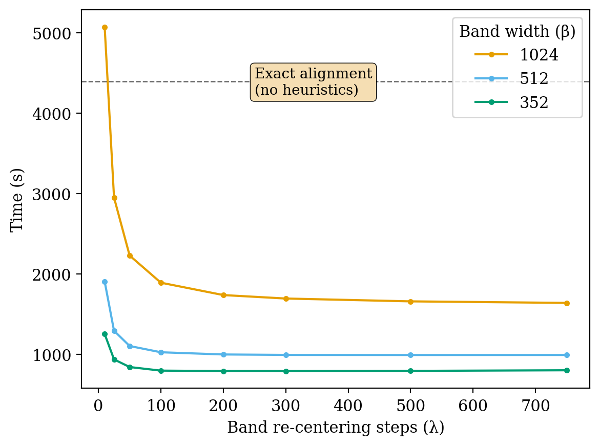
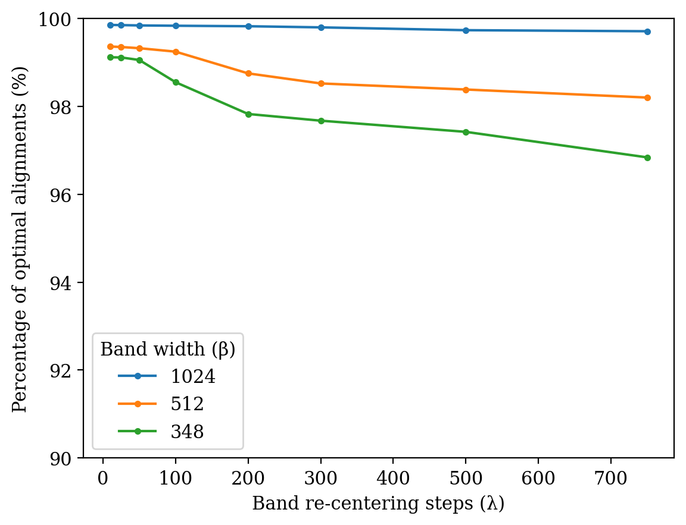

# WFA-GPU

WFA-GPU is a CUDA library for pairwise gap-affine global DNA sequence alignment on Nvidia GPUs.
It implements the [WFA algorithm](https://academic.oup.com/bioinformatics/article/37/4/456/5904262)

## Build

Make sure you have installed an up-to-date [CUDA toolkit](https://developer.nvidia.com/cuda-downloads), and a CUDA-capable device (i.e. an NVidia GPU).
To compile the library and tools, run the following commands:

```
git clone git@github.com:quim0/WFA-GPU.git && \
cd WFA-GPU && \
./build.sh
```

The `build.sh` script notifies if there is any missing necessary software for compiling the library and the tools.

## Tools

WFA-GPU comes with a tool to test its functionality, it is compiled (with the instruction in the section "Build") to the `bin/wfa.affine.gpu` binary.

Some usage examples are the following, note that depending on the amount of
memory available on the GPU, batch size may be increased or decreased:
* `.seq` file, banded: `./bin/wfa.affine.gpu -i PacBioHiFi.seq -b 100000 -e 3000 -t 512 -x -B auto -o hifi.out`
* `.seq` file, exact: `./bin/wfa.affine.gpu -i PacBioHiFi.seq -b 100000 -e 3000 -t 512 -x -o hifi.out`
* `.fasta` files, exact: `./bin/wfa.affine.gpu -Q query.PacBioHiFi.fasta -T target.PacBioHiFi.fasta -b 100000 -e 3000 -t 512 -x -o hifi.out`

Running the binary without any arguments lists the help menu:

```
[Input/Output]
        -i, --input-seq                     (string) Input sequences file in .seq format: File containing the sequences to align in .seq format.
        -Q, --input-fasta-query             (string) Input query file in .fasta format: File containing the query sequences to align (if not using a .seq file).
        -T, --input-fasta-target            (string) Input target file in .fasta format: File containing the target sequences to align (if not using a .seq file).
        -n, --num-alignments                (int) Number of alignments: Number of alignments to read from the file (default=all alignments)
        -o, --output-file                   (string) Output File: File where alignment output is saved.
        -p, --print-output                  Print: Print output to stderr
        -O, --output-verbose                Verbose output: Add the query/target information on the output
[Alignment Options]
        -g, --affine-penalties              (string) Affine penalties: Gap-affine penalties for the alignment, in format x,o,e
        -x, --compute-cigar                 Compute CIGAR: Compute the optimal alignment path (CIGAR) of all the alignments, otherwise, only the distance is computed.
        -e, --max-distance                  (int) Maximum error allowed: Maximum error that the kernel will be able to compute (default = maximum possible error of first alignment)
        -b, --batch-size                    (int) Batch size: Number of alignments per batch.
        -B, --band                          (int) Banded execution: If this parameter is present, a banded approach is used (heuristic).The parameter tells how many steps to wait until the band is re-centered. Use "auto" to use an automatically generated band.
[System]
        -c, --check                         Check: Check for alignment correctness
        -t, --threads-per-block             (int) Number of CUDA threads per alginment: Number of CUDA threads per block, each block computes one or multiple alignment
        -w, --workers                       (int) GPU workers: Number of blocks ('workers') to be running on the GPU.
[Examples]
        ./bin/wfa.affine.gpu -i sequences.seq -b <batch_size> -o scores.out
        ./bin/wfa.affine.gpu -i sequences.seq -b <batch_size> -B auto -o scores-banded.out
        ./bin/wfa.affine.gpu -Q queries.fasta -T targets.fasta -b <batch_size> -o scores.out
        ./bin/wfa.affine.gpu -Q queries.fasta -T targets.fasta -b <batch_size> -x -o cigars.out
```

Choosing the correct alignment and system options is key for performance. The tool tries to automatically choose adequate parameters, but the user
may have additional information to make a better choice. It is especially important to limit the maximum error supported by the kernel as much as
possible (`-e` parameter), this constrains the memory used per alignment and helps the program to choose better block and grid sizes. Keep in mind that any alignment having an error higher than the specified with the `-e` argument will be computed on the CPU, so, if this argument is too small, performance can decrease.

For big alignments, setting a band (i.e. limiting maximum wavefront size) with the `-B` argument can give significant
speedups, at the expense of potentially losing some accuracy in corner cases.

## Using WFA-GPU in your project

This is a simple example of how to use WFA-GPU on your projects, for extended examples, see the files in `examples/`.

``` c
#include "include/wfa_gpu.h"

// ...

// Create and initialize the aligner structure
wfagpu_aligner_t aligner = {0};
wfagpu_initialize_aligner(&aligner);

// Add the sequences to align: wfagpu_add_sequences(&aligner, query, target)
wfagpu_add_sequences(&aligner, "GAATA", "GATACA");
wfagpu_add_sequences(&aligner, "CATTAATCTT", "CAGTAAT");
// ... Add as many sequence pairs as you need

// Initialize the alignment parameters (*after* the sequences have been
// added)
affine_penalties_t penalties = {.x = 2, .o = 3, .e = 1};
wfagpu_initialize_parameters(&aligner, penalties);

// Optionally set batch size (number of sequences aligned in parallel)
wfagpu_set_batch_size(&aligner, 10);

// Compute the backtrace and generate the alignment CIGAR, if this is set
// to false (default), only the affine distance is computed.
aligner.alignment_options.compute_cigar = true;

// Align all sequence pairs
wfagpu_align(&aligner);

// Get error (score) of first alignment
aligner.results[0].error
// Get ASCII CIGAR of first alignment (char*)
aligner.results[0].cigar.buffer
```

To compile, use the following options, where `$WFAGPU_PATH` is the path of this repository.

```
gcc test_wfagpu.c -o test-wfagpu -I $WFAGPU_PATH/lib/ -I $WFAGPU_PATH -L $WFAGPU_PATH/build/ -L $WFAGPU_PATH/external/WFA/lib/ -lwfagpu -lwfa -lm -fopenmp
```

Then, to execute the generated binary, the OS needs to be able to find the dynamic library `$WFAGPU_PATH/build/libwfagpu.so`. A fast and easy way of doing so is adding it into the `LD_LIBRAY_PATH` environment variable (`export LD_LIBRARY_PATH=$LD_LIBRARY_PATH:$WFAGPU_PATH/build/`).

## Troubleshooting

#### cudaErrorLaunchTimeout

When a screen is connected, the maximum kernel time is 5 seconds. Disable the GUI or choose a smaller batch size to reduce kernel execution time.
On Ubuntu-based systems, the GUI can be disabled with the command `sudo systemctl isolate multi-user.target` (keep in mind that this will close all applications on your desktop environment such as browsers, text editors... etc).

#### Out of memory

The program is trying to use too much memory. Decrease batch size or maximum error supported by the kernel. The aligner tool stores all sequences in the main memory
before starting the alignment on the GPU, if your machine does not have enough memory, it can also raise an out-of-memory error on the CPU side.

## Guidelines for WFA-GPU Approximated Alignment

There is a tradeoff between the (β,λ) parameters and the recall and execution time of the method. When using a large bandwidth (β), a λ=100 is sufficient and, when using a smaller β, setting λ around 50 is recommended. In any case, the accuracy drop is usually small (<3%). The following table shows an example of how time and recall are affected by (β,λ) changes. Unless optimal accuracy is paramount, default (β,λ) parameters will yield a good balance between execution time and minimal loss in recall.

<table align="center">
  <tr>
    <td><p align="center">Time (in seconds)</p></td>
    <td><p align="center">Recall (%)</p></td>
  </tr>
  <tr>
    <td></td>
    <td></td>
  </tr>
</table>
<p align=center><sub><sub>Time and recall achieved with different heuristic parameters for the Nanopore dataset.</sub></sub></p>

## Problems and suggestions

Open an issue on GitHub or contact the main developer: Quim Aguado-Puig (quim.aguado.p@gmail.com)

## License

WFA-GPU is distributed under the MIT license.

## Citation

Quim Aguado-Puig, Max Doblas, Christos Matzoros, Antonio Espinosa, Juan Carlos Moure, Santiago Marco-Sola,  Miquel Moreto. WFA-GPU: Gap-affine pairwise alignment using GPUs. bioRxiv (2022). DOI [2022.04.18.488374](https://doi.org/10.1101/2022.04.18.488374)
